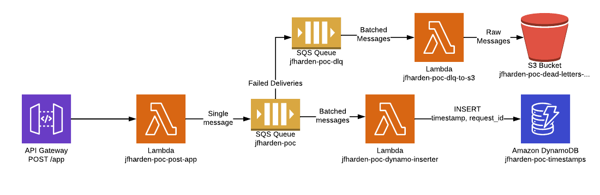

# System design

I've chosen to implement the solution using API Gateway, Lambda, SQS, and DynamoDB (along with an S3 bucket for a dead
letter queue to deliver to).

I'm using terraform 0.12 to provision and deploy the service.

I wrote the command line tools in pythnon 3.8.



I'm inserting the timestamp (iso8601 format), along with the api gateway request id. I did this since there is the
possibility of collision with multiple requests hitting the endpoint in the same microsecond ("Scientists have
calculated that the chances of something so patently absurd actually existing are millions to one.  But magicians have
calculated that million-to-one chances crop up nine times out of ten" - Terry Pratchett, Mort) will generate identical
timestamps and since the timestamp is the partition key in dynamo we would lose all but a single instance. Including
the request\_id as an ordering key this gives us a perfect record of all requests (and would make it easier to debug
potentially if we did see collisions in a production system).

A resource group is created so that you can see all the resources grouped together easily in the aws console, or with
the cli:

```
$ aws resource-groups list-group-resources --group-name jfharden-poc --region eu-west-2
```

The final url has an extra path element (https://domain/dev/app), this is a side effect of not using a custom domain.
In a real deployment I would be using a custom domain instead of default api gateway domain. I could have "hidden" this
by naming the api deployment stage "app" and using the root, but that's really a hack and would be more surprising than
useful.

## Design Considerations

### Choice of a decoupled event driven architecture

I chose to make the requests submit events into a queue (SQS) which would be consumed separately and entered into the
database in batches. This has the following benefits:

* Client requests do not depend on the speed of the database to ingest
* Requests get buffered before going into the database and are entered in batches which is a significantly more
  efficient process for most databases
* If the database is down for any reason (undergoing maintainence, during a disaster scenario etc) requests will still
  be accepted and buffered and retried 20 times giving much higher availablility to clients and easier more
  stress-free maintainince to the engineers.
* If the database comes unexpected high load requests will buffer while the autoscaling scales up the database meaning
  congestion during the scaling activity will not affect clients or ingestion of raw data.
* SQS will give us automatic retries so if the insert fails for any reason it will get retried up to 20 times.
* Any requests which fail to insert after this time will be delivered to a dead letter queue (configured to store the
  files on s3), this allows for analysis to be performed later on failed requests to understand what's happening, it
  also means in the event of a extended outage you have lost no raw data and can catch up by replaying the requests
  which did not make it into the database.
* It's easy to change where the data is going by changing the consumer of the queue, so if DynamoDB turned
  out to be a poor choice it would be easy to swap it out with another data store.

### Choice of database

I've chosen to use DynamoDB for this proof of concept. I do not know how the data will be used later or accessed,
depending how the data needs to be accessed Dynamo could be a poor choice, if we need to read out all of the entries,
order them, or aggregate them then Dynamo is not a good choice, although we could alleviate that by using an [AWS DynamoDB to
S3 datapipeline task](https://docs.aws.amazon.com/datapipeline/latest/DeveloperGuide/dp-template-exportddbtos3.html).
More likely however a different choice of database would be more suitable, possible a multi-az AWS Aurora (Postgres
Compatible would be my choice) database. Another alternative (depending on how the data is used) is to batch up the
requests and write them as parquet (for example) files to s3, then query with AWS Athena/Elastic Map Reduce.

I chose DynamoDB since this is a proof of concept and Dynamo gives us the following benefits:

* Lowest overhead to get the POC running
* Full point in time recovery for every second in the most recent 35 days
* Fully managed and automated replication over 3 availability zones in a single AWS Region (with the possibility to
  expand to multiple regions using a DynamoDB Global table)
* Trivial to create backups, with easy recovery.
* Easy monitoring with cloudwatch metrics and alarms (more comprehensive monitoring is easy with an external provider
  such as SignalFX or Datadog)
* Relatively easy autoscaling
* Extremely low maintainence requirements and low burden on operational/infrastructure teams

Since the architecture is decoupled from the api request by an event queue it would be easy to replace DynamoDB with a
different database, or to replace the simple SQS queue with something more fully featured (Kinesis, Kafka, maybe
Firehose depending on the volume) which would make delivery to multiple end points easier, all of these solutions
impart higher complexity though and so carry additional maintainence overheads and higher cognitive load to understand
the system.

### Choice of api

I chose to use API gateway to provide the api layer with each request triggering an AWS lambda.

Using API gateway with lamdbda has the following benefits

* Automatically highly available
* Easy to integrate with cloudfront and AWS Web Application Firewall, or an external provider such as cloudflare for
  DDOS prevention etc.
* Scales to extremely large volumes when required

There are some negatives

* Depending on the existing skills and deployment pipelines of the developments teams this approach may require
  additional training and engineering of delivery pipelines (it's more common in my experience to have developers
  already comfortable delivering a service via a docker container into ECS/Kubernetes)
* Lambda cold starts can mean some requests may take extra time (on the order of a few seconds in bad cases), but this
  can be mitigated in a production deployment by either setting the lambda to have provisioned capacity so it's always
  warm (at additional cost) or by artificially hitting the endpoint to keep the lambda in use (monitoring systems may
  provide this as a side effect of monitoring the endpoint).

## Monitoring, alerting, and observability

We can get an excellent insight into this system using AWS X-ray giving us distributed tracing which covers every
element of the system. We can also create alarms for when X-ray detects increased latency or errors anywhere in the
distributed system. I haven't implemented x-ray as part of this solution but it is trivial to add in.

We can also monitor the following cloudwatch metrics with a preferred monitoring tool (Cloudwatch Alerts configured to
look at Cloudwatch metrics would suffice at a minimum, or a more sophisticated tool that integrates with AWS would be
better still (such as SignalFx or DataDog)).

* API Gateway
  * Error rates (4xx, 5xx HTTP statuses), initially configured on static values but when real traffic trends are
  established in production you can use historical analysis, and possibly even predictive trend analysis to alert more
  dynamically, altough these can be difficult to get right and cause alert fatigue if they fire a lot.
  * Request Counts: Depending on the level of production traffic you would monitor for either a large sudden increase,
  or too few requests (or both). As with error rates historical trend analysis can help here, but you need an
  established baseline over a statistically significant period, taking into account seasonal trends.
  * Duration of requests
* AWS Lambdas (all 3)
  * Errors - The number of invocations that resulted in an error
  * Throttles - The number of times AWS throttled your invocations (which do not show up in the Errors count)
  * Duration - How long the lambda executions took
* SQS - Primary queue
  * NumberOfMessagesSent - This is the number of messages sent into the queue. In a sophisticaed monitoring tool we
    could compare this with the number of successful invocations of the api gateway lambda. Otherwise we can use
    static/historical analysis.
  * NumberOfMessagesDeleted - The number of messages that have been deleted by a client receiving the message (which
    acknowledges the message has been processed). In a sophisticaed monitoring tool we can compare these to messages
    sent over a rolling window to see if the queue is growing in size.
* SQS - Dead letter queue
  * NumberOfMessagesSent - This will tell us that there is a complete failure to deliver these messages to DynamoDB, if
    there is a significant rate of these it could indicate a serious system problem.
* DynamoDB
  * There are numerous things to monitor for with DynamoDB, so rather than recount them all here I will link to the AWS
    blog post which lists everything you should be monitoring for DynamoDB in production systems
    https://aws.amazon.com/blogs/database/monitoring-amazon-dynamodb-for-operational-awareness/
  * The most important in my eyes though (having any is better than none, and you have to start somewhere) are:
    * UserErrors - Errors caused by bad requests
    * SystemErrors - Errors internal to DynamoDB
    * ThrottledRequests - How many requests have been throttled (which would hopefully be transient while the
      autoscaling kicks in, until you reach your maximum capacity, even then with the buffering from SQS unless this is
      sustained over a long period this may not be a problem)
    * ConsumedWriteCapacityUnits - How much write capacity you are using

We should also monitor the general health of the web api. This could be achieved by sending known synthetic traffic
through the system, or more likely allow the posting lambda to also respond to a get request to acknowledge it is
alive. If we were using a custom domain this would be easy with Route53 health checks looking at the domain (or an
external service such as Pingdom).

We could also monitor the cost of the solution by setting up an AWS Budget for a well known tag applied to
every resource and creating a budget alert.

We would probably not want to alert an on call engineer for all of these (or even most), but for select metrics,
and even for those it would be better to have a low priority and high priority alerts. Low priority alerts only being
received during business hours and ideally configured to alert in advance of an incident becoming serious.

All of the lambda functions will log to cloudwatch logs, api gateway has this ability as well, but I have not enabled
it since it requires setting an account-wide permission for api gateway to stream to cloudwatch logs. I do not wish to
tamper with any account wide settings in another persons AWS account. In production it's very likey I would enable
this with an appropriate log format for the consumer (Apache Common Log Format, JSON, etc).

## Requirements to productionise

There are a number of things you would need to do in order to productionise this system. They are:

* Enable alerting as described above.
* Create comprehensive integration tests.
* Create real deployment pipelines to deploy changes to the infrastructure and lambdas, giving each pipeline it's own
  permissions to perform deployments so administrator privileges are not required. (If people were to manually deploy
  then roles can be created for terraform to assume which have the correct permissions and require multi-factor auth.)
* Break out lambdas into their own git projects (an oppinionated choice on my part, but not set in stone) so they can
  have individial unit tests, integration tests, and potentially deployment pipelines.

## Security

A few notes on the security of this deployment:

* There is encryption at every stage, API Gateway will receive connections over HTTPS, and every stage afterwards uses
  encryption at rest using a custom KMS key
* There are no access restrictions on hitting the api gateway endpoint, this would be easy to add with a policy by IP,
  or easy to add an API Key, other less trivial methods are available such as cognito auth, or custom authorizers.
* I've rate limited the api gateway connection on purpose to 100 per second, with a burst capability of an additional
  50 requests per second. This is probably not an appropriate configuration for a production system, but for this POC
  that seems fine. Changing it is trivial if that is too restrictive.
* There is no level of DDOS protection in this solution beyond
  [AWS' automatic DDOS protection](https://docs.aws.amazon.com/waf/latest/developerguide/ddos-responding.html). You
  could add AWS Web Application Firewall rules, or use another provider as a proxy (such as cloudflare)
* For better regulatory compliance you could deploy all of this inside a VPC and use a VPC Endpoint to provide access
  to dynamo.

## Disaster recovery

### Dynamo

I have enabled point in time recovery which gives the ability to recover to any single second in the last 35 days, in
production I would also expect to create longer term backups using "manual" backups, these can be easily scheduled with
a Cloudwatch event rule run on a schedule.

Restoration can be from either the point in time recovery, or a restore of a "manual" backup. Given that point in time
gives you 35 days of recovery you are probably in serious trouble if you need to recover further back than that.
However if you do, possibly to audit a past incident you hadn't detected, you could restore a manual backup to a new
dynamo cluster (or over the top of the existing one, but that might be a new disaster in itself given how old it is).

Having the manual backups would also allow data scientists (or other people) to have a copy of the production data
restored to export or perform analysis on. This is also a potential way to run load tests against real data volumes.

### Message delivery into dynamo

If messages fail to be delivered into Dynamo they will go as JSON files to s3 via the dead letter queue. These can be
replayed by posting the contents back into the primary SQS queue, and can also be investigated for poison pill
messages.

### Other resources

All other resources can be recreated by running terraform apply again. The URL of the endpoint will change in my exact
solution, but in production I would use a custom domain for the API gateway endpoint which would resolve it.
